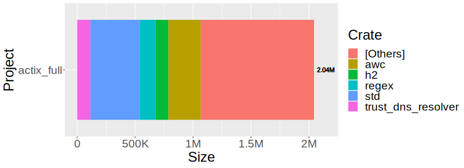
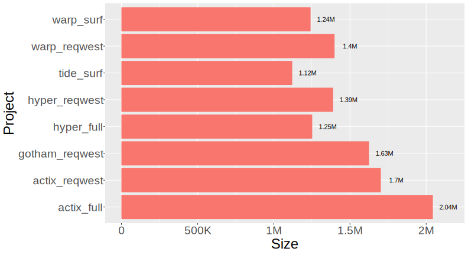

# Web-Client-Server Binary-Size Benchmark - Rust

This small benchmark is intended to compare how different combinations of HTTP
Client and HTTP Server will affect the binary size of applications.

The base application we will be covering here has some basic requirements that
are based on needs that we have for our real-world app.
The app also have some usage of OpenSSL,
which is also a requirement of our app,
as we need to handle RSA signature validation,
so if any implementation make use of code defined there will have a valid advantage.
This are the requirement for all binaries implementation:

* A running server to respond to requests from a local client;
* A client to make local requests to the server;
* A second client to make requests to a remote server;
* Clients needs to handle:
  * JSON serialization and deserialization;
  * HTTP Header extraction;
* Share state between the Remote Client and the App;
* Asynchronous type signature;

## Implementations rules

The [RULES.md](RULES.md) file describe how implementations should be made.

## Contestants

| Implementation  |   Server  | Client  |
|:---------------:|:---------:|:-------:|
| dummy           | -         | -       |
| actix\_full     | actix-web | awc     |
| actix\_reqwest  | actix-web | reqwest |
| gotham\_reqwest | gotham    | reqwest |
| hyper\_full     | hyper     | hyper   |
| hyper\_reqwest  | hyper     | reqwest |
| warp\_surf      | warp      | surf    |
| tide\_surf      | tide      | surf    |
| warp\_reqwest   | warp      | reqwest |

## Data Collected

The total binary size and,
mainly,
the distribution of the size contribution by crate is generated using [cargo bloat](https://github.com/RazrFalcon/cargo-bloat).
Although not 100% precise,
we believe it's estimations are reliable enough for the data we've collected and analysed.

For all contestants in this benchmark we have collected information with different build options.
All builds are generated with *cargo*'s release build plus a combination of the following flags:

|  Parameter    | Values             |
|:-------------:|:------------------:|
| [Optimization]  | [0, 1, 2, 3, s, z] |
| [LTO]           | [thin, fat]        |
| [Codegen Units] | [1, 16]            |

[Optimization]: https://doc.rust-lang.org/cargo/reference/profiles.html#opt-level
[LTO]: https://doc.rust-lang.org/cargo/reference/profiles.html#lto
[Codegen Units]: https://doc.rust-lang.org/cargo/reference/profiles.html#codegen-units

## Analysis and Results

The main lessons we've learned from checking the results of our benchmark can be summarised in three points:

1. [Don't be afraid of using micro-dependencies](#dont-fear-micro-dependencies);
2. [Set some extra optimization flags](#set-the-optimization-flags);
3. [The most suitable pair for us is tide-surf](#tide-surf-the-current-winner);

Here on the repository README.md we will be presenting a feel graphs in order to illustrate our analysis;
the full data, as well as some more interactive graphs,
are available at [this shinyapp](https://jonathas-conceicao.shinyapps.io/web-client-server-binary-size-benchmark-rs/) for anyone who wants to have a more complete view of it.

### Don't fear micro-dependencies

It's easy to see how having multiple dependencies can largely affect build time of our projects.
But when it comes to binary size, the data we collected tells us that there is little to worry there.
Take for example the following plot for the major crates on our larger contestant, `actix_full`:

Figure: *`actix_full` with top crates highlighted ([Interactive graph](https://jonathas-conceicao.shinyapps.io/web-client-server-binary-size-benchmark-rs/)).*

Even after optimization,
the plot shows that only 5 of it's total 76 crates accounts for over 50% of it's binary size.

The following box plot show the distribution of all crates size across all projects.
This shows that the vast majority of dependencies contribute very little to the total binary size.

Figure: *Crates size distribution ([Interactive graph](https://jonathas-conceicao.shinyapps.io/web-client-server-binary-size-benchmark-rs/)).*

Therefore we find it much more meaningful to choose carefully the core dependency for or apps,
then it is to trying to minimise the total number of dependencies.

### Set the optimization flags

Binary Size optimization is not the default goal that the rust compiler aims to achieve,
but it can get there if the developer requests it.
The following plot shows how different optimization options affects the Binary Size on our smaller contestant, `tide_surf`.

Figure: *Optimization parameters on `tide_surf` ([Interactive graph](https://jonathas-conceicao.shinyapps.io/web-client-server-binary-size-benchmark-rs/)).*

Cargo's default release build uses Optimization Level 3, LTO Thin and 16 Codegen Units.
Comparing that to the smaller binary we've generated we can see a improvement of around 40%.
All other projects have shown better results when using Optimization Z, LTO Fat and 1 Codegen Unit,
so that will be our default flags for smaller binary size.

### tide-surf, the current winner

The [async-std](https://github.com/async-rs/async-std) based pair, `tide-surf`,
is our new choice of HTTP client-server pair for embedded applications.
Despite having a high level API, it still had better results that more lower level APIs such as `hyper_full`.

If we were to choose a pair that's built fully on top of [tokio](https://github.com/tokio-rs/tokio),
another of the main runtimes for rust's async ecosystem,
we will definitely be considering [warp](https://github.com/seanmonstar/warp).
The crate has presented a small Binary Size overhead over [hyper](https://github.com/hyperium/hyper) for a much more simpler API for building HTTP servers.

Figure: *All projects size ([Interactive graph](https://jonathas-conceicao.shinyapps.io/web-client-server-binary-size-benchmark-rs/))*

## Contributing

New pairs of applications are welcome provided they meet the rules specified to compete.

## License

Licensed under Apache License, Version 2.0 (LICENSE-APACHE or https://www.apache.org/licenses/LICENSE-2.0).
